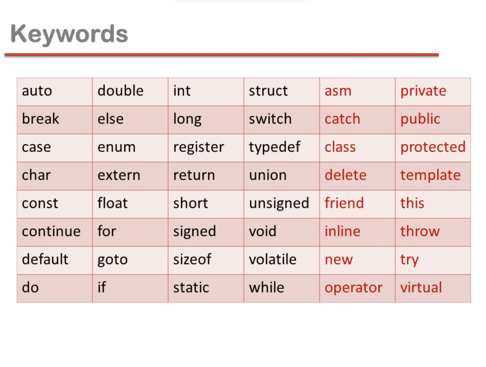

### Constants

- any information is called constant
- every software manage information
- data = information(name, song, photo, numbers) = constant
- types of constant

- secondary constant are made with the help of primary constant

### variables

- variables are the names of memory locations where we store data
- variable name is any combinations of alphabet (a-z or A-Z), digit(0-9) and underscore(\_)
- valid variable name cannot start with digit

### Keywords or predefine words or reserved words

### Data types

- int: integer
- char: character
- float: real
- double: real
- void

