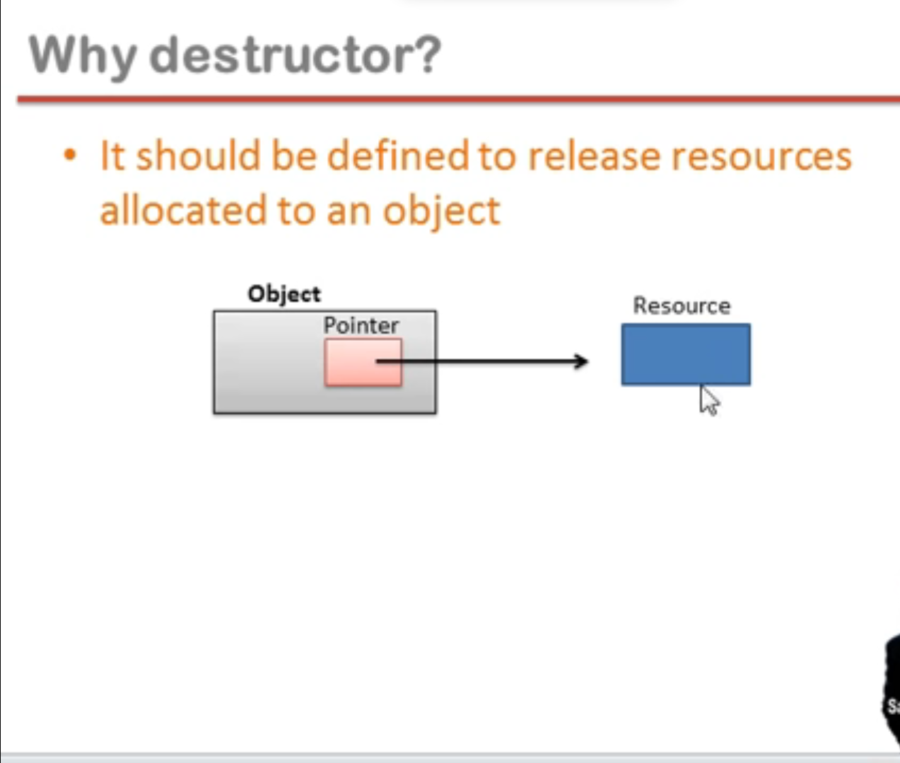

## Destructor

- Destructor is an instance member function of a class
- The name of the destructor is same as the name of a class but preceded by tilda ~ symbol
- Destructor can never be static
- Destructor has no return type
- Destructor takes no arguments (no overloading is possible)
- The destructor function invokes implicitly when object is going to destroy

```cpp
#include<iostream>
using namespace std;

class Complex{
private:
    int a;
    int b;

public:
// Destructor
    ~Complex(){
      cout << "Destructor called"
    }

};

void fun(){
  Complex obj;
}

int main(){
  fun()

  return 0;
}
```

#### Why need destructor ?

- It should be defined to release resources allocated to an object


