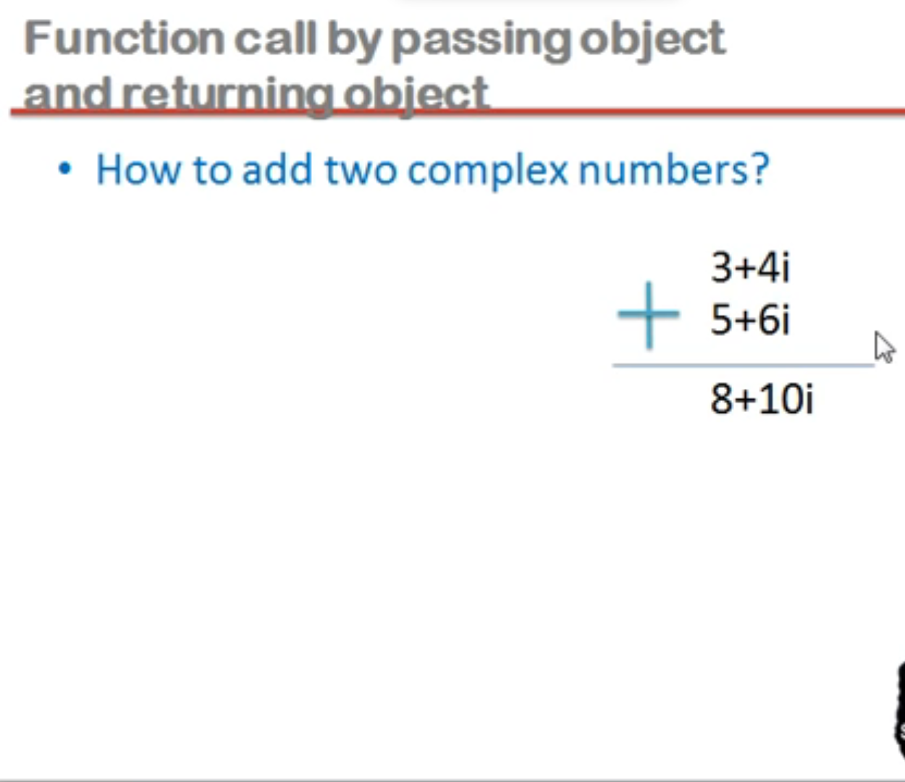

## Reference variable in C++

#### Types of vaiable

1. ordinary variable
1. pointer variable
1. reference variable


#### reference variable

- Reference means address
- Reference variable is an internal pointer
- Declaration of reference variable is preceded with '&' symbol (but do not read it as 'address of')
- Reference variable must be initialized during declaration
- It can be initialized with already declared variables only
- Reference variable can not be updated

---

## Functions in C++

#### What is function?

- Function is a block of code performing a unit task
- Function has a name, return type and arguments
- Function is a way to achieve modularization
- Functions are predefined and user defined
- Predefined functions are declared in header files and defined in library files

#### Definition, Declaration and Call


- Function declaration is also know as function prototype
- Functions need to be declared before use(just like variables)
- Functions can be declared locally or globally
- Return type functionName(argumentList);
- Function definition is a block of code

#### Declaration

#### Ways to define a function

- Takes nothing, return nothing
- Takes something, return nothing
- Takes nothing, return something
- Takes something, returns something

#### Formal and Actual

takes something return something


#### Types of formal arguments

Formal arguments can be of three types

1. Ordinary variable of any type
1. Pointer variable
1. Reference variable

#### Call by value, call by address and call by reference


---

## Inline function

#### Benefits of function

- easy to read
- easy to modify
- avoids rewriting of same code
- easy to debug
- better memory utilization

#### Function saves memory

- function in a program is to save memory space which becomes appreciable when a function is likely to be called many times

#### Function is time consuming

- However every time a function is called, it takes lot of extra time in executing a series of instructions for tasks such as jumping to the function, saving registers, pushing arguments into the stack and returning to the calling function

- so when function is small it is worthless to spend so much time in such tasks in cost of saving comparatively small space

#### Inline function

- To eliminate the cost of calls to small functions, C++ proposes a new feature called inline function
- An inline function is a function that is expanded in line when it is invoked
- Compiler replace the function call with the corresponding code

#### Inline is a request

- inline is a request not a command
- the benefit of speed of inline functions reduces as the function grows in size
- so the compiler may ignore the request in some situations.

Few of them

- Function containing loop, switch, goto.
- Function with recursion
- Containing static variable


---

#### Function overloading

There are three type in C++ to implement polymorphism

- function overloading (compile time polymorphism)
- operator overloading (compile time polymorphism)
- virtual function (run time polymorphism)

🔴 lecture 5 part 4 code

#### How function overloading is resolved

- first, C++ tries to find an exact match. THis is the case where the actual arguments exactly matches the parameter type of one of the overloaded function
- If no exact match is found, C++ tries to find a match through promotion
  - char, unsigned char, and short is promoted to an int
  - float is promoted to double
- if no promotion is found. C++ tries to find a match through standard conversion

## Structure

#### structure three important points

- structure is collection of dissimilar elements
- structure is a way to group variable
- structure is used to create data type

🔴 code
...

## Classes and objects

- THe only difference between structure and class is that
  - the members of structure are by default public
  - the members of class are by default private

class

```cpp
#include<iostream>
using namespace std;

class Complex{
  private:
    int a;
    int b;

  public:
    void setData(int x, int y){
      a = x;
      b = y;
    }

    void showData(){
      cout << a << " " << b;
    }
};


int main(){
  // c1 is an object
  Complex c1;
  // noun.verb
  c1.setData(3,4);
  c1.showData();
  return 0;
}
```

---

structure

```cpp
#include<iostream>
using namespace std;

struct Complex{
  private:
    int a;
    int b;

  public:
    void setData(int x, int y){
      a = x;
      b = y;
    }

    void showData(){
      cout << a << " " << b;
    }
};


int main(){
  // c1 is an variable
  Complex c1;
  c1.setData(3,4);
  c1.showData();
  return 0;
}
```

## Function call by passing object and returning object



```cpp
#include<iostream>
using namespace std;

class Complex{
private:
    int a;
    int b;

public:
    void setData(int x, int y){
        a = x;
        b = y;
    }

    void showData(){
        cout << a << " " << b;
    }

    Complex add(Complex c){
        Complex temp;
        temp.a = a + c.a;
        temp.b = b + c.b;
        return(temp);
    }
};


int main(){
    Complex c1, c2, c3;
    c1.setData(3,4);
    c2.setData(5,6);
    c3 = c1.add(c2);
    c3.showData();

    return 0;
}
```

## Technical jargon

- class is a description of an object
- object is an instance of a class

- instance member variable
  - attribute, data member, fields, properties
- instance member functions
  - methods, procedures, actions, operations, services

## Static members in C++

- static local variables
- static member variables
- static member functions

#### static local variable

- concept as it is taken from C
- they are by default initialized to zero
- their lifetime is throughout the program

```cpp
#include<iostream>
using namespace std;

void fun(){
  static int x;
        int y;
}
```

---

#### Static member variable

- declared inside the class body
- also know as class member variable
- they must be defined outside the class
- static member variable does not belong to any object, but to the whole class
- there will be only one copy of static member variable for the whole class
- any object can use the same copy of class variable
- they can also be used with class name

```cpp
#include<iostream>
using namespace std;

class Account{
  private:
  // instance member variable
    int balance;
    //static member variable or class variable
    static float rateOfInterest;

  public:
    void setBalance(int b){
      balance = b;
    }
};


//membership label ::
// by default is 0
float Account:: rateOfInterest = 3.5f;

void main(){
  Account a1;

}
```

---

##
