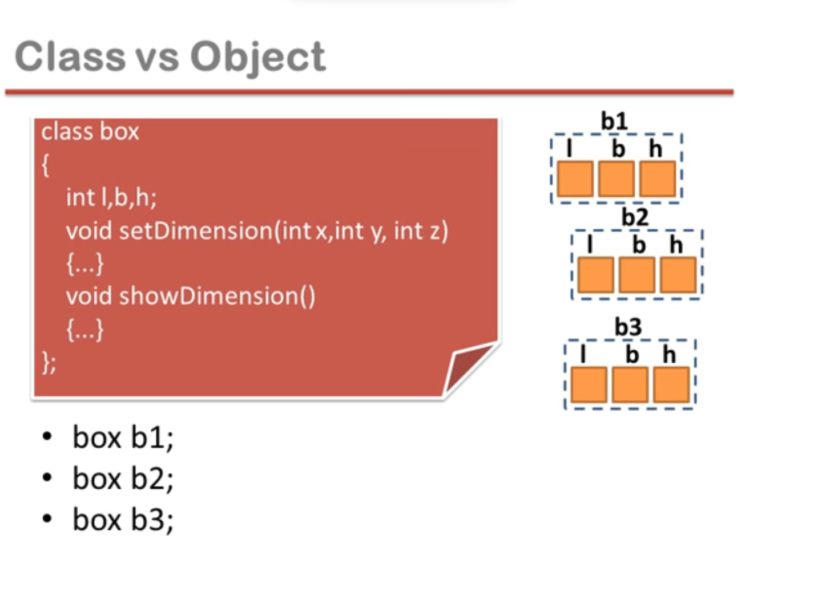
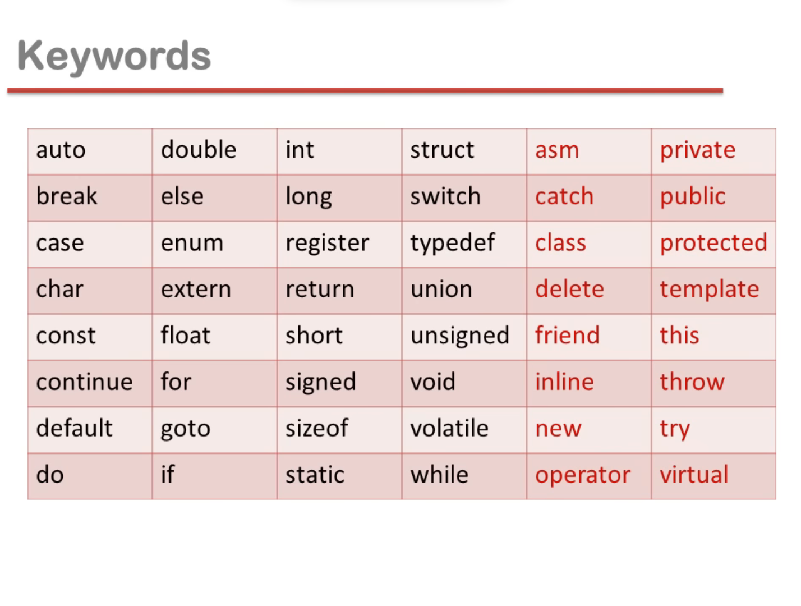

## History of C++

- Invented by Bjarne stroustrup
- ⬇️ put photo
- 1978-1979 launch
- AT & T bell labs
- C with classes
- 1983 C++

## Facts of C++

- C++ OOP was inspired by computer simulation language called Simula67
- JAVA is written in C++
- Major operating systems of modern times are written in C++
- C++ is world 4 most used programming language

## Features of C++

- C++ is a middle level language, means we can do low level programming(machine dependant coding- device drivers) and high level programming(application software- hardware independent coding)
- C++ support principle of Object oriented paradigm
- C++ joins three separate programming traditions

1. procedural language tradition, represent by C
1. object-oriented language tradition, represented by the class enhancements C++ adds to C
1. generic programming, supported by C++ templates

---

## Comparison between C and C++

- C++ is a super set of C language means we can use old features in C++ provided in C
- C++ programs can use existing C software libraries
- C follows top down approach of programming
- C++ follows bottom up approach of programming
- C adopts procedural oriented programming
- C++ adopts object oriented programming

---

## What is Object oriented programming

- OOPs is a programming approach which revolves around the concept of "Objects".
- Any entity in the system that can be defined as a set of properties and set of operations performed using entity's property set, is known as object
- 5 principle

1. Encapsulations
1. Data Hiding
1. Abstraction
1. Polymorphism
1. Inheritance

---

## Classes and Objects

- class is a blueprint of an object
- class is class a description of Object's property set and set of operations
- creating class is as good as defining a new data type
- class is a means to achieve encapsulation
- object is a run time entity
- object is an instance of a class



```cpp
class box{
  int l, b, h;

  void setDimension(int x, int y, int z){
    // logic
  }


  void showDimension(){
    // logic
  }
};
```

---

## Software development process in c++


---

## Identifier

#### Constants

- any information is constant
- every software manage information
- data = information(name, song, photo, numbers) = constant
- types of constant


- secondary constant are made with the help of primary constant


#### variables

- variables are the names of memory locations where we store data
- variable name is any combinations of alphabet (a-z or A-Z), digit(0-9) and underscore(\_)
- valid variable name cannot start with digit

### Keywords or predefine words or reserved words



---

## Identifier Data types

- int: integer
- char: character
- float: real
- double: real
- void


---

## Input output in C++

#### Output instruction

- In C, standard output device is monitor and printf() is use to send data/message to monitor
- printf() is a predefine function
- In C++, we can use cout to send data/message to monitor
- cout is an object, character out
- cout is predefine object
- The "<<" operator is called string insertion or put to operator


#### Input instrucction

- In C, standard input is keyboard and scanf() is use to receive data from keyboard
- scanf() is a predefined function
- In C++, we can use cin to input data from keyboard
- The identifier cin is a predefine object in C++
- The ">>" operator is know as string extraction or get from operator


#### About iostream.h

- According to ANSI standards for C language, explicit declaration of function is recommended but not mandatory
- ANSI standards for C++ language says explicit declaration of function is compulsory (means declaration of function in header file is compulsory in C++)
- Header files: predefine functions are declared in header files, so whenever you are using any predefine function in your code, you have to include specific header file that contain its declaration
- We need to include header file iostream.h, it contains declaration for the identifier cout and the operator "<<". And also for the identifier cin and operator ">>".
- Header files contains declaration of identifier
- Identifier can be variable name, function name, macro, object etc.

#### endl

- Inserting endl into the output stream causes the screen cursor to move to the beginning of the next line.
- endl is a manipulator and it is declared in iostream.h
- '\n' character also works as it works in C for moving into next line

#### Sample program


---

## Reference variable in C++

#### Types of vaiable

1. ordinary variable
1. pointer variable
1. reference variable


#### reference variable

- Reference means address
- Reference variable is an internal pointer
- Declaration of reference variable is preceded with '&' symbol (but do not read it as 'address of')
- Reference variable must be initialized during declaration
- It can be initialized with already declared variables only
- Reference variable can not be updated

---

## Functions in C++

#### What is function?

- Function is a block of code performing a unit task
- Function has a name, return type and arguments
- Function is a way to achieve modularization
- Functions are predefined and user defined
- Predefined functions are declared in header files and defined in library files

#### Definition, Declaration and Call


- Function declaration is also know as function prototype
- Functions need to be declared before use(just like variables)
- Functions can be declared locally or globally
- Return type functionName(argumentList);
- Function definition is a block of code

#### Declaration

#### Ways to define a function

- Takes nothing, return nothing
- Takes something, return nothing
- Takes nothing, return something
- Takes something, returns something

#### Formal and Actual

takes something return something


#### Types of formal arguments

Formal arguments can be of three types

1. Ordinary variable of any type
1. Pointer variable
1. Reference variable

#### Call by value, call by address and call by reference


---

## Inline function

#### Benefits of function

- easy to read
- easy to modify
- avoids rewriting of same code
- easy to debug
- better memory utilization

#### Function saves memory

- function in a program is to save memory space which becomes appreciable when a function is likely to be called many times

#### Function is time consuming

- However every time a function is called, it takes lot of extra time in executing a series of instructions for tasks such as jumping to the function, saving registers, pushing arguments into the stack and returning to the calling function

- so when function is small it is worthless to spend so much time in such tasks in cost of saving comparatively small space

#### Inline function

- To eliminate the cost of calls to small functions, C++ proposes a new feature called inline function
- An inline function is a function that is expanded in line when it is invoked
- Compiler replace the function call with the corresponding code

#### Inline is a request

- inline is a request not a command
- the benefit of speed of inline functions reduces as the function grows in size
- so the compiler may ignore the request in some situations.

Few of them

- Function containing loop, switch, goto.
- Function with recursion
- Containing static variable


---

#### Function overloading

There are three type in C++ to implement polymorphism

- function overloading (compile time polymorphism)
- operator overloading (compile time polymorphism)
- virtual function (run time polymorphism)

🔴 lecture 5 part 4 code

#### How function overloading is resolved

- first, C++ tries to find an exact match. THis is the case where the actual arguments exactly matches the parameter type of one of the overloaded function
- If no exact match is found, C++ tries to find a match through promotion
  - char, unsigned char, and short is promoted to an int
  - float is promoted to double
- if no promotion is found. C++ tries to find a match through standard conversion

##
