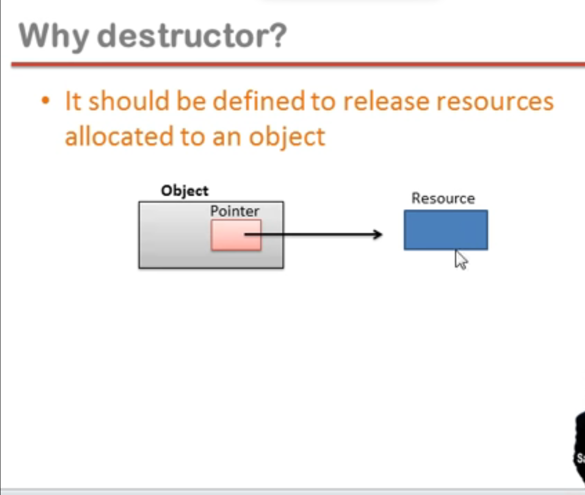

## Static member function

- they are qualified with the keyword static
- they are also called class member functions
- they can be invoked with or without object
- they can only access static members of the class

```cpp
#include<iostream>
using namespace std;

class Account{
  private:
  // instance member variable
    int balance;
    //static member variable or class variable
    static float rateOfInterest;

  public:
    void setBalance(int b){
      balance = b;
    }

    static void setRateOfInterest(float r){
      rateOfInterest = r;
    }
};


//membership label ::
// by default is 0
float Account:: rateOfInterest = 3.5f;

void main(){
  Account a1, a2;
  Account::setRateOfInterest(4.5f);
}
```

---

## Constructor

- Constructor is a member function of a class
- The name of the constructor is same as the name of the class
- It has no return type, so can't use return keyword
- It must be an instance member function, that is, it can never be static

#### How to call constructor?

- constructor is implicitly invoked when an object is created
- constructor is used to solve problem of initialization

```cpp
#include<iostream>
using namespace std;

class Complex{
private:
    int a;
    int b;

public:
    Complex(){
      cout << "Hello constructor" << endl;
    }
};


int main(){
    Complex c1, c2, c3;

    return 0;
}
```

#### What is the problem of initialization?

- Why it is called constructor?
- What is problem of initialization?
- How constructor resolves this issue?

---

#### Default constructor

```cpp
#include<iostream>
using namespace std;

class Complex{
private:
    int a;
    int b;

public:
// default constructor
  Complex(){}
};


int main(){
  // default constructor will be created by compiler in object file
    Complex c1, c2, c3;

    return 0;
}
```

#### Parameterized constructor

```cpp
#include<iostream>
using namespace std;

class Complex{
private:
    int a;
    int b;

public:
// parameterize constructor
    Complex(int x, int y){
      a = x;
      b = y;
    }

// parameterize constructor
    Complex(int k){
      a = k;
    }

// default constructor
    Complex(){
      a = 0;
      b = 0;
    }
};


int main(){
    Complex c1(3, 4);
    // can be written as
    // Complex c1 = Complex (3, 4);

    Complex c2(5);
    //can be written as only for single value constructor
    // Complex c2 = 5;
    Complex c3;

    return 0;
}
```

#### Constructor Overloading

```cpp
#include<iostream>
using namespace std;

class Complex{
private:
    int a;
    int b;

public:
// parameterize constructor
    Complex(int x, int y){
      a = x;
      b = y;
    }

// parameterize constructor
    Complex(int k){
      a = k;
    }

// default constructor
    Complex(){
      a = 0;
      b = 0;
    }
};


int main(){
    Complex c1(3, 4);
    // can be written as
    // Complex c1 = Complex (3, 4);

    Complex c2(5);
    //can be written as only for single value constructor
    // Complex c2 = 5;
    Complex c3;

    return 0;
}
```

---

## Copy constructor

```cpp
#include<iostream>
using namespace std;

class Complex{
private:
    int a;
    int b;

public:
// parameterize constructor
    Complex(int x, int y){
      a = x;
      b = y;
    }

// parameterize constructor
    Complex(int k){
      a = k;
    }

// default constructor
    Complex(){

    }

    //copy constructor
    Complex(Complex &c){
      a = c.a;
      b = c.b;
    }
};


int main(){
    Complex c1(3, 4);

    Complex c2(5);

    Complex c3;

    // copy constructor called
    Complex c4(c1);
    // can be written as Complex c4 = c1;


    return 0;
}
```

---

## Destructor

- Destructor is an instance member function of a class
- The name of the destructor is same as the name of a class but preceded by tilda ~ symbol
- Destructor can never be static
- Destructor has no return type
- Destructor takes no arguments (no overloading is possible)
- THe destructor function invokes implicitly when object is going to destroy

```cpp
#include<iostream>
using namespace std;

class Complex{
private:
    int a;
    int b;

public:
// Destructor
    ~Complex(){
      cout << "Destructor called"
    }

};

void fun(){
  Complex obj;
}

int main(){
  fun()

  return 0;
}
```

#### Why need destructor ?

- It should be defined to release resources allocated to an object



---

## Operator overloading

```cpp
#include<iostream>
using namespace std;

class Complex{
private:
    int a;
    int b;

public:
    void setData(int x, int y){
        a = x;
        b = y;
    }

    void showData(){
        cout << a << " " << b << endl;
    }

    Complex add( Complex c){
        Complex temp;
        temp.a = a + c.a;
        temp.b = b + c.b;
        return(temp);
    }
};


int main(){
    Complex c1, c2, c3;
    c1.setData(3, 4);
    c2.setData(5, 6);

    // won't work compiler don't know the definition
    // c3 = c1 + c2;

    c3 = c1.add(c2);
    c3.showData();

    return 0;
}
```

---

changing method name add to sum

```cpp
#include<iostream>
using namespace std;

class Complex{
private:
    int a;
    int b;

public:
    void setData(int x, int y){
        a = x;
        b = y;
    }

    void showData(){
        cout << a << " " << b << endl;
    }

    Complex sum( Complex c){
        Complex temp;
        temp.a = a + c.a;
        temp.b = b + c.b;
        return(temp);
    }
};


int main(){
    Complex c1, c2, c3;
    c1.setData(3, 4);
    c2.setData(5, 6);

    // won't work compiler don't know the definition
    // c3 = c1 + c2;

    c3 = c1.sum(c2);
    c3.showData();

    return 0;
}
```

---

Operator overloading

- When an operator is overloaded with multiple jobs, it is know as operator overloading
- It is a way to implement compile time polymorphism

#### Rules to remember

- Any symbol can be used as function name
  - If it is a valid operator in C language
  - If it is preceded by operator keyword
- You can not overload sizeof and ? : operator

```cpp
#include<iostream>
using namespace std;

class Complex{
private:
    int a;
    int b;

public:
    void setData(int x, int y){
        a = x;
        b = y;
    }

    void showData(){
        cout << a << " " << b << endl;
    }

    // how to use preexisting operator name for function naming
    Complex operator +( Complex c){
        Complex temp;
        temp.a = a + c.a;
        temp.b = b + c.b;
        return(temp);
    }
};


int main(){
    Complex c1, c2, c3;
    c1.setData(3, 4);
    c2.setData(5, 6);

    // won't work compiler don't know the definition
    // c3 = c1 + c2;

    // Approach 1: can be written as
    c3 = c1.operator + (c2);

    // Approach 2: can be written as
    c3 = c1 + c2;

    c3.showData();

    return 0;
}

// Binary operator overloading
// c3 = c1 + c2
// here c1 is the caller object
```

---

## Unary operator overloading

- Overloading of unary operator

```cpp
#include<iostream>
using namespace std;

class Complex{
private:
    int a;
    int b;

public:
    void setData(int x, int y){
        a = x;
        b = y;
    }

    void showData(){
        cout << a << " " << b << endl;
    }

   //
   Complex operator-(){
        Complex temp;
        temp.a = -a;
        temp.b = -b;
        return(temp);
    }
};


int main(){
    Complex c1, c2, c3;
    c1.setData(3, 4);

    // approach 1
    c2 = c1.operator-();

    // approach 2
    c2 =- c1;

    c2.showData();

    return 0;
}
```

---

## Increment operator overloading

- Overloading of unary operator ++(pre & post)

```cpp
#include<iostream>
using namespace std;

class Integer{
private:
    int x;

public:
    void setData(int a){
        x = a;
    }

    void showData(){
        cout << "x = " << x;
    }
};


int main(){
    Integer i1;
    i1.setData(3);
    i1.showData();

    return 0;
}

// output
//x = 3
```

---

pre increment operator

```cpp
#include<iostream>
using namespace std;

class Integer{
private:
    int x;

public:
    void setData(int a){
        x = a;
    }

    void showData(){
        cout << "x = " << x << endl;
    }

    // preincrement
    Integer operator++(){
        Integer i;
        i.x =++ x;
        return (i);
    }
};


int main(){
    Integer i1, i2;
// i2 = i1.operator++();
//  i2 = ++i1;
    i2 = ++i1;
    i1.showData();
    i2.showData();

    return 0;
}

// output
//x = 3
```

---

post increment

```cpp
#include<iostream>
using namespace std;

class Integer{
private:
    int x;

public:
    void setData(int a){
        x = a;
    }

    void showData(){
        cout << "x = " << x << endl;
    }

    // preincrement
    Integer operator++(){
        Integer i;
        i.x =++ x;
        return (i);
    }

    //  post increment
    Integer operator++(int){
        Integer i;
        i.x = x++;
        return i;
    }
};


int main(){
    Integer i1, i2;
    i1.setData(3);
    i1.showData();
    i2 = i1++;
    i2.showData();

    return 0;
}

// output
//x = 3
//x = 3
```

---

```cpp
#include<iostream>
using namespace std;

class Complex{
private:
    int a;
    int b;

public:
    void setData(int x, int y){
        a = x;
        b = y;
    }

    void showData(){
        cout << a << " " << b << endl;
    }

    friend Complex operator +(Complex, Complex);
};


// how to use preexisting operator name for function naming
Complex operator +( Complex X, Complex Y){
    Complex temp;
    temp.a = X.a + Y.a;
    temp.b = X.b + Y.b;
    return(temp);
}


int main(){
    Complex c1, c2, c3;
    c1.setData(3, 4);
    c2.setData(5, 6);

    // old explanation
    // c1 calls member function i.e "+" operator, then c2 passed as an argument, then what is returned by "+" is assigned to c3
    // c3 = c1.operator+(c2)

    // new explanation
    // c3 = operator+(c1, c2)
    c3 = c1 + c2;

    c3.showData();

    return 0;
}


// output
// 8 10
```

---

##
